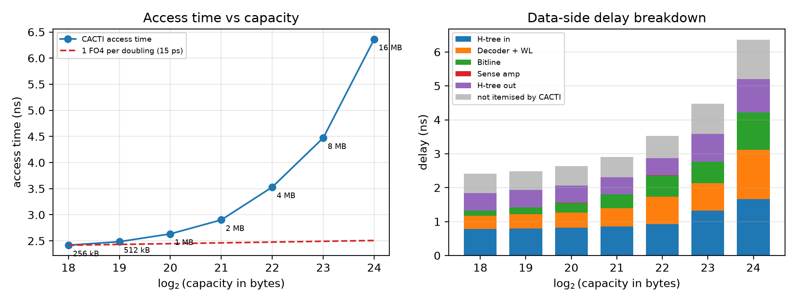

# Part B, Task 2 — Capacity sweep, 256 kB to 16 MB

Only `-size (bytes)` varies. Everything else stays at the Task 1 baseline.

| Capacity | Access (ns) | Δ per doubling (ps) | Read energy (pJ) | Leakage (mW, all 4 banks) | Area (mm²) | Ndwl/Ndbl/Nspd |
|---|---|---|---|---|---|---|
| 256 kB | 2.417 | — | 658.0 | 361 | 4.96 | 4/2/1 |
| 512 kB | 2.485 | 67 | 679.0 | 632 | 5.95 | 4/2/1 |
| 1 MB | 2.634 | 149 | 716.6 | 1175 | 7.60 | 4/2/1 |
| 2 MB | 2.902 | 268 | 792.9 | 2250 | 11.47 | 4/2/1 |
| 4 MB | 3.531 | 629 | 930.1 | 4409 | 18.46 | 4/2/1 |
| 8 MB | 4.473 | 942 | 1219.8 | 8735 | 39.50 | 4/4/1 |
| 16 MB | 6.362 | 1890 | 1742.1 | 16978 | 74.67 | 2/8/1 |

## Is "one gate delay per doubling" visible?

**No**, for two reasons that compound.

**The slope is far too steep.** At 45 nm ITRS-HP, FO4 is roughly 15 ps, so the
Amrutur–Horowitz rule predicts ~15 ps per doubling and ~90 ps across the whole
six-doubling sweep. CACTI gives 3945 ps — a mean slope of 658 ps per doubling,
about **44 FO4**.

**The curve is not linear in log₂(capacity),** which is what the rule requires.
The increments grow monotonically — 67, 149, 268, 629, 942, 1890 ps — so each
doubling costs more than the last. A constant-gate-delay law gives equally
spaced points on a straight line; the data is convex.

## Why

The rule assumes the array is repartitioned as it grows so local wire lengths
stay roughly constant, leaving only the decoder's logarithmic depth to grow.
That holds for the array proper and fails for everything outside it.

Here the cache stays at 4 banks by construction, so area grows 15× (4.96 →
74.67 mm²) and the H-tree that distributes addresses and collects data grows
with the linear dimension of that area, roughly √capacity. Interconnect is
40–54 % of access time at every point in the sweep — a √C term sitting on top of
a log C term. That is the convexity.

| Component | 256 kB | 16 MB | Growth |
|---|---|---|---|
| H-tree in + out | 1.294 ns | 2.653 ns | 2.05× |
| Decoder + wordline + bitline + sense | 0.540 ns | 2.548 ns | 4.72× |
| Not itemised by CACTI | 0.583 ns | 1.161 ns | 1.99× |

Even the array term grows 4.7×, not the ~6 FO4 ≈ 0.09 ns the rule would allow,
because the organisation can only repartition in discrete steps. Ndwl × Ndbl
stays at 4×2 from 256 kB to 4 MB, so each doubling in that range doubles the
subarray and therefore the bitline and wordline length. CACTI repartitions at
8 MB (4×4) and 16 MB (2×8): the array term freezes at 1.4406 ns from 4 MB to
8 MB, and the H-tree jumps 716 ps in the same step. The cost moves between the
two terms; it does not go away.

FO4 derivation and the sensitivity of the conclusion to it: `../findings.md`.
